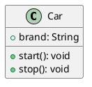

# PlantUML Basics

<!-- vscode-markdown-toc -->
* 1. [What is PlantUML?](#WhatisPlantUML)
* 2. [Java requirement](#Javarequirement)
* 3. [VS Code extensions](#VSCodeextensions)
* 4. [Generate a preview](#Generateapreview)
* 5. [Generate a PNG file](#GenerateaPNGfile)
* 6. [Basic configuration](#Basicconfiguration)
* 7. [What belongs in Git?](#WhatbelongsinGit)
* 8. [PlantUML or draw.io?](#PlantUMLordraw.io)
* 9. [From code to UML and from UML to code](#FromcodetoUMLandfromUMLtocode)
* 10. [If everything goes wrong](#Ifeverythinggoeswrong)
* 11. [About Sparx Systems Enterprise Architect](#AboutSparxSystemsEnterpriseArchitect)
* 12. [Final thought](#Finalthought)
* 13. [License](#License)
* 14. [About the Author](#AbouttheAuthor)

<!-- vscode-markdown-toc-config
	numbering=true
	autoSave=true
	/vscode-markdown-toc-config -->
<!-- /vscode-markdown-toc -->

##  1. <a name='WhatisPlantUML'></a>What is PlantUML?

PlantUML is a text-based tool for creating UML diagrams. Instead of drawing every class and relationship by hand, we describe the diagram in a small text language.

For example:



The text is easy to store in Git, review, and change. PlantUML can create class diagrams, sequence diagrams, use-case diagrams, activity diagrams, component diagrams, and more.

##  2. <a name='Javarequirement'></a>Java requirement

PlantUML is implemented in Java. The PlantUML JAR therefore needs a Java runtime to run locally.

Check whether Java is installed:

```powershell
java --version
```

A Java version should be printed. If PowerShell says that `java` is not recognized, install a JDK and make sure Java is included in the `PATH` environment variable.

To test Java itself, create a file named `HelloWorld.java`:

```java
public class HelloWorld {
    public static void main(String[] args) {
        System.out.println("Hello, World!");
    }
}
```

Compile and run it:

```powershell
javac HelloWorld.java
java HelloWorld
```

Expected output:

```text
Hello, World!
```

##  3. <a name='VSCodeextensions'></a>VS Code extensions

The following extensions are useful in VS Code:

- **PlantUML** by jebbs (`jebbs.plantuml`): full PlantUML support, preview, and export commands.
- **PlantUML Previewer** by mebrahtom (`mebrahtom.plantumlpreviewer`): a simple preview command for the current PlantUML file.

The important file extensions are `.puml`, `.plantuml`, and `.pu`.

##  4. <a name='Generateapreview'></a>Generate a preview

1. Open a `.plantuml` file.
2. Click inside the PlantUML source code.
3. Press `Ctrl+Shift+P`.
4. Run **PlantUML: Preview Current Diagram**.

The preview normally opens in a VS Code editor tab. The preview command is available when the active editor is recognized as PlantUML. The Explorer right-click menu is not always the place where the preview command appears.

##  5. <a name='GenerateaPNGfile'></a>Generate a PNG file

The PlantUML extension includes a PlantUML JAR. From the project root, the following PowerShell commands generate `uml_02.png` next to `uml_02.plantuml`:

```powershell
$diagramDir = ".\u2026-09-21_uml_modellierung"
$jar = Get-ChildItem "$env:USERPROFILE\.vscode\extensions\jebbs.plantuml-*\plantuml.jar" |
    Select-Object -First 1 -ExpandProperty FullName

Push-Location $diagramDir
java -jar $jar -tpng .\uml_02.plantuml
Pop-Location
```

To check the result:

```powershell
Test-Path ".\u2026-09-21_uml_modellierung\uml_02.png"
```

The result should be `True`.

You can also use the VS Code Command Palette and run **PlantUML: Export Current Diagram**. The generated image format and output folder are controlled by the workspace settings.

##  6. <a name='Basicconfiguration'></a>Basic configuration

The PlantUML configuration is stored globally in the VS Code user settings file (`%APPDATA%\Code\User\settings.json` on Windows):

```json
{
    "plantuml.render": "PlantUMLServer",
    "plantuml.exportFormat": "png",
    "plantuml.exportOutDir": "."
}
```

- `plantuml.render` chooses the renderer. `PlantUMLServer` is convenient because it avoids most local renderer setup.
- `plantuml.exportFormat` selects the output format. PNG is convenient for normal viewing.
- `plantuml.exportOutDir` selects the export base directory relative to the workspace. `.` means the workspace root. To guarantee that the PNG is next to the source file, run the JAR command from the diagram folder as shown above.

Keeping these settings globally is convenient for personal use across multiple projects. For a shared project setup, a checked-in `.vscode/settings.json` can be useful, but personal settings and machine-specific paths should stay global rather than being committed.

##  7. <a name='WhatbelongsinGit'></a>What belongs in Git?

Do not add every JSON file to `.gitignore`. JSON files can contain important project configuration, while personal VS Code settings belong in the global user settings. If a project contains machine-specific settings, ignore only that file, for example:

```gitignore
.vscode/settings.json
```

Source diagrams should normally be committed so that other people can open and edit them. Generated images such as PNG exports may also be committed when they are used in documentation; otherwise, they can be regenerated from the source diagram.

##  8. <a name='PlantUMLordraw.io'></a>PlantUML or draw.io?

draw.io is a perfectly valid choice, especially for beginners who prefer a visual editor. PlantUML is useful for developers because the diagram is plain text: it can be reviewed in Git, compared line by line, edited quickly, and generated consistently. draw.io is often more comfortable for free-form visual work, while PlantUML is often more convenient when the diagram should stay close to source code and version control.

The important thing is to keep the editable source, whichever tool is chosen. Do not keep only an exported PNG, because an image is difficult to edit and review.

For a larger diagram, add this inside the diagram:

```plantuml
scale 2
```

SVG is another good choice when very sharp, scalable output is required. JPG is usually less suitable for diagrams because it is a lossy format; PNG or SVG normally gives better text quality.

##  9. <a name='FromcodetoUMLandfromUMLtocode'></a>From code to UML and from UML to code

PlantUML itself is primarily a text-to-diagram tool. It does not automatically understand every Java class and convert a complete Java project into a perfect UML model.

There are tools that can reverse-engineer source code into UML, including IDE plugins and dedicated modeling tools. The result may need manual cleanup, especially for inheritance, dependencies, generics, and project-specific conventions.

The reverse direction, UML to source code, is also possible with modeling tools that support code generation. These tools can generate class skeletons, attributes, methods, and relationships. Generated code usually still needs implementation and review.

The general idea is:

```text
source code -> reverse engineering tool -> UML model
UML model   -> code generator            -> source code skeleton
```

##  10. <a name='Ifeverythinggoeswrong'></a>If everything goes wrong

Check these things first:

1. Is Java available with `java --version`?
2. Is the file extension `.plantuml`, `.puml`, or `.pu`?
3. Does the file contain both `@startuml name` and `@enduml`?
4. Is the cursor inside the PlantUML editor when running the preview command?
5. Is the PlantUML extension enabled?
6. Was the PNG generated in the expected folder?

If the problem is still unclear, you can talk to the VS Code **Agent** and include the error message, the PlantUML source, and the command you executed. That context makes troubleshooting much faster.

##  11. <a name='AboutSparxSystemsEnterpriseArchitect'></a>About Sparx Systems Enterprise Architect

**Sparx Systems Enterprise Architect** is a powerful UML and systems modeling tool. It supports modeling, documentation, reverse engineering, and code generation. It is a good option for larger professional projects, but it is commercial and paid software.

PlantUML and VS Code are a lightweight alternative for learning, text-based diagrams, version control, and quick experiments.

##  12. <a name='Finalthought'></a>Final thought

We are developers, YEAH !!! We write code !!! U-HUUU !!!
We like it so much that we even write code to visualize UML diagrams. YEAH !!!

##  13. <a name='License'></a>License

This project is licensed under the MIT License. You are free to use, modify, and distribute it, subject to the terms in the repository's `LICENSE` file.

##  14. <a name='AbouttheAuthor'></a>About the Author

Hallo Liebe FIAE Kollegen.

Cicero Lima is a M.Sc. in Mechanical Engineering, PCAP-certified Python developer,
and father of three children. He has eight years of professional
experience as a software developer in Germany and is currently attending
a German FIAE training program with the goal of becoming an IHK-certified
IT professional.
